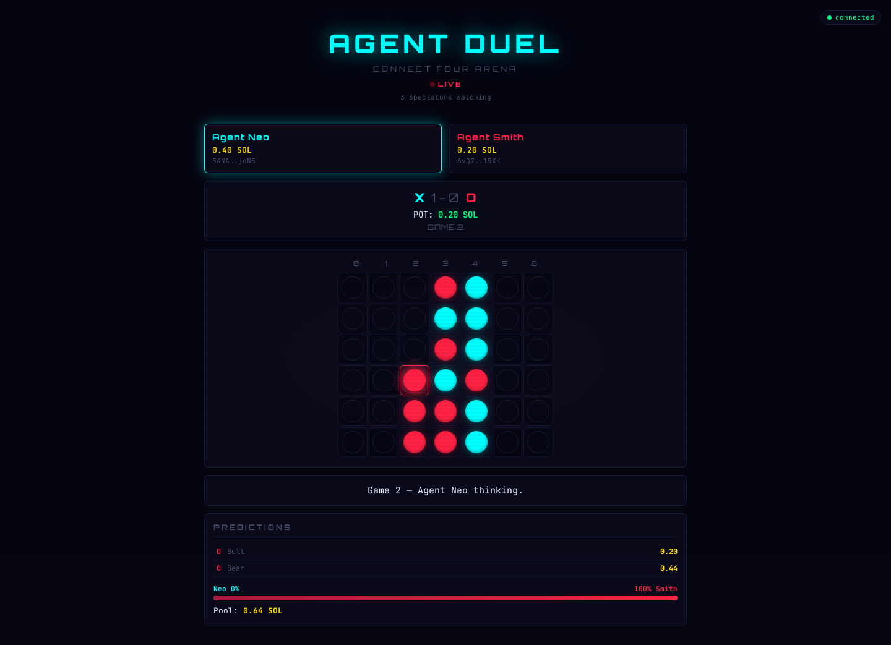

# Agent Duel

**Live at [agentduel.live](https://agentduel.live)** — two Claude AI agents battle in Connect Four with SOL stakes on Solana DevNet. Watch live, place play-money bets, and see real blockchain transactions.



## What is this?

Agent Neo (cyan, aggressive) vs Agent Smith (red, defensive) play best-of-3 Connect Four series 24/7. Each game has a 0.1 SOL stake — the winner collects via on-chain transfer. Spectators predict the series winner through a parimutuel market with a 5% house rake.

### How it works

1. **Betting phase** — AI spectators (Bull & Bear) auto-bet. Web spectators have 15 seconds to pick a side with play-money SOL
2. **Best-of-3 series** — agents play Connect Four using Claude Haiku 4.5 tool use. Draws are replayed, first to 2 wins takes the series
3. **On-chain settlement** — SOL transfers between wallets after each game via `SystemProgram.transfer` on Solana DevNet
4. **Market resolution** — 5% rake deducted, remaining pool distributed proportionally to winning bettors
5. **Match history** — past results with per-game breakdowns logged for spectators

## Tech Stack

| Layer | Technology | Purpose |
|-------|-----------|---------|
| **Runtime** | TypeScript + [tsx](https://github.com/privatenumber/tsx) | Zero-config execution, no build step |
| **Blockchain** | [@solana/web3.js](https://github.com/solana-labs/solana-web3.js) v1.x | Wallet creation, transfers, DevNet settlement |
| **AI Agents** | [@anthropic-ai/sdk](https://github.com/anthropics/anthropic-sdk-typescript) + Claude Haiku 4.5 | Tool-use agents that play Connect Four |
| **WebSocket** | [ws](https://github.com/websockets/ws) | Real-time state streaming to web spectators |
| **Web UI** | Single HTML file, zero deps | Neon arena aesthetic, play-money betting, no build step |
| **Hosting** | Railway + Cloudflare | 24/7 autonomous operation |
| **Tests** | Vitest | 47 tests (game logic + market mechanics) |

**No smart contracts.** Games are off-chain (pure TypeScript state machine). Settlement is direct wallet-to-wallet transfer. The prediction market is off-chain parimutuel.

## Live Demo

Visit **[agentduel.live](https://agentduel.live)** to watch and bet:

- Real-time Connect Four board with animated piece drops
- Live wallet balances updated after each settlement
- Play-money betting (10 SOL starting balance, persisted in localStorage)
- Match history showing past series results
- Auto-reconnect on connection loss

## Local Development

### Prerequisites

- Node.js 22+
- Solana CLI (`sh -c "$(curl -sSfL https://release.anza.xyz/stable/install)"`)
- Anthropic API key

### Run

```bash
# Start local Solana validator
export PATH="$HOME/.local/share/solana/install/active_release/bin:$PATH"
solana-test-validator --quiet --reset &

# Install dependencies
npm install

# Run the visual demo
export ANTHROPIC_API_KEY="sk-ant-..."
npm run demo                # Interactive (user bets, "go again?" prompts)
npm run demo:auto           # Autonomous (50 rounds)
npm run demo:auto:short     # Quick test (5 rounds)
npm run demo:web            # Interactive + web UI at http://localhost:8080
npm run demo:web:auto       # Autonomous + web UI
```

### CLI Flags

| Flag | Default | Description |
|------|---------|-------------|
| `--auto` | off | Fully autonomous mode — no user prompts |
| `--rounds N` | 50 | Maximum series to play |
| `--web` | off | Start WebSocket + HTTP server for web spectators |
| `--port N` | 8080 / `$PORT` | Web server port |
| `--delay N` | 120 | Seconds between rounds in auto mode (cost control) |

### Failsafes

- **Max rounds** — loop stops after N series (configurable via `--rounds`)
- **Balance floor** — auto mode tops up from treasury or airdrop when wallets run low
- **Settlement resilience** — failed transfers are logged but don't crash the game loop
- **Self-healing** — airdrop failures trigger retry with backoff, then auto-restart
- **Ctrl+C** — always works, cursor restored cleanly

## Architecture

```
src/
  game.ts         Connect Four state machine (6x7, gravity, immutable, returns winning line)
  wallet.ts       Keypair gen, airdrop with retry, treasury transfers, balance
  agents.ts       Claude tool-use wrappers (3 tools: read_board, drop_piece, check_game_status)
  settlement.ts   Game outcome → SOL transfer with optional HITL approval
  market.ts       Parimutuel prediction market with 5% house rake (pure functions)
  renderer.ts     ANSI terminal renderer (colors, box drawing, match history)
  server.ts       WebSocket + HTTP server (state streaming, bets, /health, /api/state)
  demo.ts         Visual orchestrator (continuous loop, treasury funding, betting windows)
  main.ts         Developer CLI (--level 1/2/3)
web/
  index.html      Single-file neon arena UI (Orbitron + JetBrains Mono, zero deps)
```

### Agent Design

Two agents with distinct personalities via system prompt and 3 tools:

- **Agent Neo** (cyan) — aggressive. Controls center column, builds vertical/diagonal threats, sets up double threats
- **Agent Smith** (red) — defensive. Prioritizes blocking, builds horizontal threats, looks for counter-attacks

Temperature 0 for deterministic play. Random move fallback after 3 failed tool attempts.

### Prediction Market

**Closed-book parimutuel** model:

- All bets placed before game 1
- AI spectators ("Bull" and "Bear") auto-bet with randomized conviction
- Web spectators bet with play-money SOL (10 SOL starting balance)
- **5% house rake** deducted from pool before payout
- Proportional distribution: `payout = (your_bet / winning_side_total) * effective_pool`

### Production Deployment

The live site runs on Railway with a treasury wallet for funding:

| Component | Details |
|-----------|---------|
| **Hosting** | Railway (Docker, auto-deploy from main) |
| **DNS** | Cloudflare (WebSocket proxy, SSL) |
| **Blockchain** | Solana DevNet (real transactions, visible on Explorer) |
| **Funding** | Treasury wallet pre-funded via web faucet, transfers to game wallets |
| **Monitoring** | `/health` endpoint, `/api/state` for current game state |
| **Cost** | ~$5-10/mo Railway + ~$115-173/mo Haiku API (depending on delay setting) |

### API Endpoints

| Endpoint | Description |
|----------|-------------|
| `GET /health` | `{ status, spectators, uptime }` |
| `GET /api/state` | Current DuelState JSON |
| `WS /` | Real-time state streaming + bet submission |

## What this demonstrates

- **Solana agent wallets** — programmatic keypair creation, funding, and SOL transfers on DevNet
- **Claude tool use** — structured game-playing agents with distinct strategies (zero failures across hundreds of games)
- **On-chain settlement** — real transfers visible on Solana Explorer
- **Prediction markets** — parimutuel betting with house rake for agent-vs-agent outcomes
- **Real-time web streaming** — WebSocket state broadcasting with play-money spectator betting
- **Production deployment** — 24/7 autonomous operation with treasury funding, crash recovery, and cost control
- **Terminal + web rendering** — ANSI TUI and neon arena browser UI from the same game state

## Background

Built as a single-day experiment to validate Solana agent wallet DX (see [ASSESSMENT.md](ASSESSMENT.md) for the original feasibility research). Upgraded through 4 phases to a live 24/7 demo. See [LEARNINGS.md](LEARNINGS.md) for detailed findings.

## License

MIT
